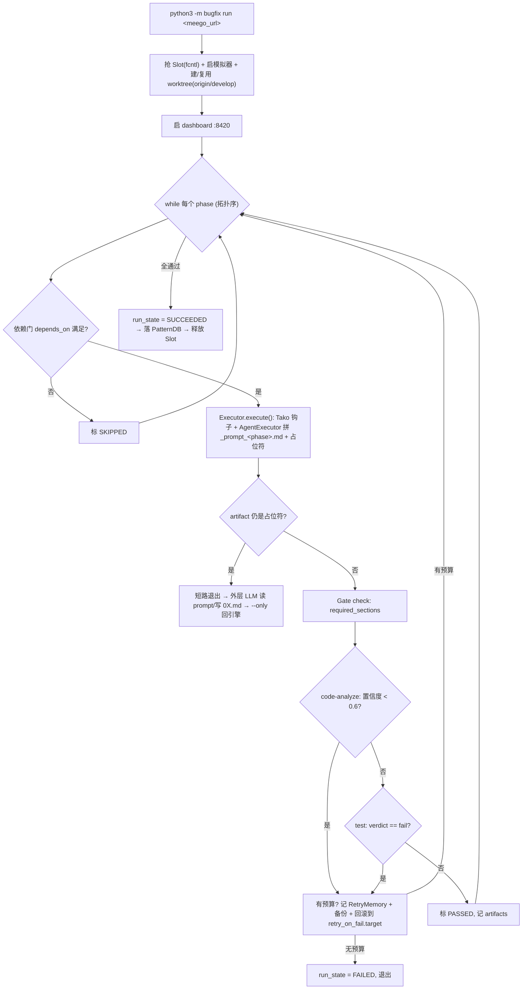

# Tako Bugfix —— 项目说明与架构解析

> 目录：`/Users/bytedance/person/bugFixlearn/tiktok-ios-plugins-marketplace/plugins/tako/bugfix`
> 定位：TikTok iOS「Tako」业务的自动化 Bugfix 流水线（Meego 工单 → 代码分析 → 修复 → 构建 → 模拟器验证 → 提 MR）。
> 本文回答一个核心问题：**它是不是「引擎驱动 Agent（Engine-driven Agent）」？** —— 结论先给：**是，而且是一个非常典型、非常克制的「引擎主控 / Agent 执行」混合架构。**

---

## 一、一句话结论

**Tako Bugfix 是一个「引擎驱动 Agent」系统，不是「Agent 自由规划」系统。**

- **控制平面（Control Plane）= 确定性 Python 引擎**（`engine.py`）：负责读取 manifest、解析阶段依赖、按拓扑序推进、状态持久化、门禁校验、失败回滚重试、并发 slot、git worktree、模拟器绑定。这一层**没有任何 LLM 调用，行为完全确定**。
- **执行单元（Execution Unit）= LLM Agent**：每个阶段（Phase）真正"动脑"的工作（读工单、定位根因、写代码、开模拟器点按验证、提 MR）交给一个大模型 Agent 完成。但 Agent **不能自由发挥**——它只能读取引擎为它拼装好的 `_prompt_<phase>.md`，按里面的硬约束执行，产出写回固定文件。
- 引擎与 Agent 的**耦合点是文件**：引擎写 `_prompt_<phase>.md`（输入契约）+ 占位 artifact；Agent 填 `0X-xxx.md`（输出契约）；引擎再对 artifact 做 gate check / 置信度门 / verdict 解析，决定"通过 / 重试回滚 / 终止"。

所以这里的"引擎"是**总指挥（状态机 + 门禁 + 编排）**，"Agent"是**被引擎按阶段调度、且被 prompt 严格约束的干活的人**。这正是"引擎驱动 Agent"的定义。

---

## 二、为什么说它是"引擎驱动"而非"Agent 驱动"

| 维度 | 引擎驱动 Agent（本项目） | Agent 自由驱动（对照） |
|------|--------------------------|------------------------|
| 谁决定下一步做什么 | **引擎**按 manifest 的 `phases` + `depends_on` 拓扑序决定 | Agent 自己规划 next step |
| 流程是否确定 | **确定**：相同 manifest → 相同阶段序 | 不确定，依赖模型即兴 |
| 状态在哪 | `run_state.json`（引擎持久化，可 resume） | 多在模型上下文里，易丢 |
| 失败怎么办 | 引擎按 `retry_on_fail.target` **回滚到指定阶段**并重跑，带 max_retries | Agent 自己决定要不要重试 |
| 质量门禁 | 引擎做：`required_sections` 章节校验 + 置信度门 + verdict 解析 | 靠模型自觉 |
| Agent 能不能"自己规划一个阶段" | **明令禁止**（SKILL.md：*"It is forbidden to plan a phase yourself without first reading the assembled `_prompt_<phase>.md`"*） | 可以 |
| 工具能不能乱换 | 不能，`tool_constraints` 里写死"必须用 X、禁止用 gh/gitlab/curl" | 可以 |

关键证据（`engine.py` 的主循环 `_run_phases`）：

- `execution_order = self._resolve_order(...)` —— 阶段序由 manifest 决定，不是模型决定。
- `if not self._deps_satisfied(spec, state): ... SKIPPED` —— 依赖门由引擎把关。
- gate check → 置信度门 → verdict：三道由引擎执行的关卡。
- 失败时 `idx = rollback_idx; continue` —— 引擎主动把"指针"拨回前面的阶段重跑。

一个很能说明问题的细节：`AgentExecutor.execute()` 拼完 prompt 后，只写了一个占位 artifact（`[Awaiting agent execution ...]`）就返回 `PASSED`。引擎随后检测到占位符会**短路退出**（`-> AWAITING AGENT (no gate check, no retry)`），把控制权交还给"外层的 LLM orchestrator"去真正跑模型、填内容，然后再 `--only <phase>` 回到引擎继续。也就是说——

> **引擎是"发号施令 + 收作业 + 判卷"的老师；LLM Agent 是"按题干答题"的学生；题干（prompt）是引擎出的，评分标准（gate）也是引擎定的。**

### 关键澄清：本引擎"自己不起模型进程"——Agent 调用有两种模式

这是一个容易搞混、且区别于其它同类实现（见第十节 IM 对比）的关键点：**Tako 的主引擎 `engine.py` 从不 `subprocess` 拉起 `cursor-agent` / `claude` 子进程**，全仓库无此调用。它只做"拼 prompt → 写占位符 → 短路退出"。真正驱动模型的有两条路径：

| 模式 | 谁在跑循环 | 谁真正调模型 | 触发场景 |
|------|-----------|-------------|----------|
| **A. 交互编排（主链路）** | 外层交互式 LLM（Claude Code / Cursor 按 `skills/tako-bugfix/SKILL.md`） | 外层 LLM 自己 | 正常 `run`：外层每阶段调 `--only <phase>` 让引擎产出 `_prompt_<phase>.md`，读它、执行、写 `0X.md`，再回引擎判卷 |
| **B. 无头返工（自动化）** | dashboard 拉起的 detached `claude -p` | 该 headless claude | 人在看板点「带反馈重做」→ `dashboard.py::_spawn_rework` 起 `claude -p <REWORK_PROMPT> --permission-mode bypassPermissions`，重跑 code-analyze→fix→build→test，最后 `git push --force-with-lease` 更新原 MR |

换言之：**引擎是"控制平面 + prompt 编译器 + 判卷器"，模型进程的生命周期由引擎之外的编排者管理**。这与 IM 前身"引擎自己 `Popen(cursor-agent)` 并 `wait()` 阻塞"的自驱模型是两条不同的工程路线（详见第十节）。

---

## 三、系统全景

### 3.1 分层视图

```
┌─────────────────────────────────────────────────────────────┐
│  编排层 (Orchestrator)  —— LLM 侧                             │
│  skills/tako-bugfix/SKILL.md  +  Claude Code / Cursor Agent   │
│  · 逐阶段调用 `python3 -m bugfix run <url> --only <phase>`    │
│  · 读引擎生成的 _prompt_<phase>.md，真正跑模型，写 0X.md       │
│  · 返工时用 headless `claude -p` 重跑 code-analyze→test       │
└───────────────▲───────────────────────────┬──────────────────┘
                │ 读 _prompt_<phase>.md        │ 写 0X-xxx.md
                │ (输入契约)                   │ (输出契约)
┌───────────────┴───────────────────────────▼──────────────────┐
│  引擎层 (Engine)  —— 确定性 Python，无 LLM                     │
│  engine.BugfixEngine                                          │
│  ├─ Manifest 解析 (manifest.yaml)                             │
│  ├─ 拓扑编排 + 依赖门 + 状态机 (run_state.json)               │
│  ├─ Gate check / 置信度门 / verdict 解析                      │
│  ├─ 失败回滚重试 (retry_on_fail)                              │
│  ├─ 并发 Slot (slot.py, fcntl 文件锁, 双模拟器)               │
│  ├─ git worktree 隔离 (每工单一 worktree, 从 origin/develop) │
│  └─ 智能增强：KnowledgeRouter / PatternDB / RetryMemory       │
└───────────────▲───────────────────────────┬──────────────────┘
                │                             │
┌───────────────┴─────────┐   ┌───────────────▼──────────────────┐
│  Executor 层 (可插拔)     │   │  产物层 (Artifacts)               │
│  phases/*.py             │   │  ~/.tako_bugfix/tasks/<wid>/      │
│  6 个业务 Executor        │   │  01~06.md, run_state.json,       │
│  + 默认 AgentExecutor     │   │  artifacts/(截图/录屏/crash)     │
└──────────────────────────┘   └───────────────────────────────────┘
```

### 3.2 目录/文件职责

| 文件 | 角色 | 说明 |
|------|------|------|
| `__main__.py` | CLI 入口 | `run / dashboard / doctor / slots / clean` 五个子命令；注册 6 个 Tako Executor |
| `manifest.yaml` | **声明式流程定义** | 项目配置 + 6 阶段定义（agent 路径、输出文件、依赖、必需章节、重试策略、工具约束） |
| `engine.py` | **编排引擎（核心）** | `BugfixEngine`（主循环）、`Manifest`、`StateStore`、`ExecutorRegistry`、worktree/slot 装配 |
| `phases/base.py` | 抽象与数据类型 | `PhaseExecutor` 抽象基类、`PhaseSpec/PhaseContext/PhaseResult`、`RunState`、枚举、`validate_output` 门禁 |
| `phases/agent_executor.py` | **默认执行器** | 把「约束+agent prompt+知识+前序产物+环境+语言规则」拼成 `_prompt_<phase>.md`；写占位 artifact |
| `phases/info_collect.py` | Executor | 先 `bytedcli meego workitem get --rich` 预取工单 YAML，再委托 agent |
| `phases/code_analyze.py` | Executor | 覆写知识注入（走 KnowledgeRouter）+ PatternDB 提示 + RetryMemory 反例 + 人审反馈 |
| `phases/fix.py` | Executor | 重试时清理陈旧 `fix/<wid>` 分支，再委托 fixer agent |
| `phases/build.py` | Executor | 薄封装，逻辑在 builder agent（Jojo 构建 + simctl 安装） |
| `phases/test.py` | Executor | agent 跑完后**解析 verdict**，`fail` → 返回 FAILED 触发回滚 |
| `phases/submit.py` | Executor | 薄封装，逻辑在 submitter agent（push + Bits MR） |
| `phases/env_check.py` | Executor | 环境预检（未在 manifest 主链路，辅助用） |
| `slot.py` | 并发控制 | `fcntl.flock` 双 slot 互斥；解析/启动模拟器 UDID；`SlotsBusyError` 快速失败 |
| `confidence.py` | 质量门 | 从 `02-analysis.md` 抽 `## Confidence`，低于阈值(0.6)触发自动重试 |
| `knowledge_router.py` | 智能注入 | TF-IDF 式关键词打分 + 领域 boost，只注入 Top-3 相关知识文件 |
| `pattern_db.py` | 机构记忆 | 成功修复落库 JSON；新 bug 查相似历史修复作为提示 |
| `retry_memory.py` | 重试智能 | 记录失败尝试为"反例"，注入下一轮分析防止重蹈覆辙 |
| `config.py` | 配置 | 读 `~/.tako_bugfix_config`、探测 plugin/project root |
| `dashboard.py` + `static/index.html` | 可视化 | 本地 Web 看板（:8420），展示进度、确认修复、带反馈重做 |
| `tests/` | 单测 | `test_slot.py` 等 |

> 注：`manifest.yaml` 里 `agent:` 指向的是 `agents/*.md`（在**上一级** `plugins/tako/agents/`，非本目录），`knowledge:` 指向 `plugins/tako/knowledge/` 与 `rules/`。本目录 `bugfix/` 是**引擎与执行器**本体。

---

## 四、核心工作流（6 阶段流水线）

```
info-collect → code-analyze → fix → build → test → submit
                    ▲                          │
                    └──── FAIL (retry ×2) ──────┘   ← test 失败回滚到 code-analyze
```

| # | 阶段 | Agent | 产物 | 必需章节（gate） | 特殊机制 |
|---|------|-------|------|------------------|----------|
| 1 | info-collect 信息收集 | info-collector.md | 01-info.md | Bug Summary / Reproduction Steps | 预取 Meego 工单 YAML |
| 2 | code-analyze 代码分析 | code-analyzer.md | 02-analysis.md | Root Cause / Confidence / Fix Strategy / AB Test Overrides | **知识路由 + PatternDB + RetryMemory + 置信度门**；`retry→code-analyze ×2` |
| 3 | fix 代码修复 | fixer.md | 03-fix.md | Changes / Self Check | 重试清理陈旧分支 |
| 4 | build 构建 | builder.md | 04-build.md | Build Result | 强制 `$JOJO_BIN build`，禁 `xcodebuild` |
| 5 | test 验证 | tester.md | 05-test.md | Verdict / Evidence | **verdict=fail → 回滚 code-analyze**；强制 `xcodebuildmcp ui-automation` 真机点按取证 |
| 6 | submit 提交 MR | submitter.md | 06-submit.md | Status / Git / Merge Request / Bits URL / mr_id / Build TikTok-T / Meego Ticket | 强制 `bytedcli bits mr create`，禁 gh/gitlab/curl |

**自主性策略**：验证 `pass` 直接提 MR，全程不中断问人；只有 `fail`/`blocked` 才停下等人。这也是"引擎驱动"的体现——流程走向由**产物内容 + 引擎规则**决定，不由模型"要不要继续"决定。

---

## 五、引擎主循环详解（`_run_phases`）

对每个阶段，引擎执行如下确定性步骤：

1. **依赖门**：`depends_on` 里的阶段必须都 `PASSED`，否则 `SKIPPED`。
2. **构造 `PhaseContext`**：注入 work_item_id、task_dir、project_root（已重绑到 worktree）、前序 artifacts、合并后的环境变量、retry_count、RetryMemory、PatternDB。
3. **取 Executor 执行**：`registry.get(phase_id).execute(ctx, spec)`。
4. **Awaiting-agent 短路**：若 artifact 仍是占位符 → 标 `PENDING`、退出，交给外层 LLM 真正填。
5. **Gate check**：`required_sections` 字符串必须全部出现在 artifact 中。
6. **置信度门**（仅 code-analyze）：`ConfidenceGate` 抽分数，< 0.6 → 判 FAILED 触发自动重试。
7. **成功** → 标 `PASSED`，记入 `artifacts`，`idx += 1`。
8. **失败 + 有重试预算** → 记 RetryMemory、备份产物（`.vN`）、**从 `retry_on_fail.target` 起清空并回滚 `idx`**、重跑。
9. **失败无重试** → 整体 `FAILED`，退出。
10. 全部通过 → `SUCCEEDED`，落库成功 Pattern。

状态全程写入 `run_state.json`，因此支持 `--from <phase>` / `--only <phase>` 断点续跑。

---

## 六、四大"智能增强"（相对普通脚本的差异化）

这些都是**引擎侧**为 Agent 准备"更好上下文"的组件，进一步印证"引擎主控"：

1. **KnowledgeRouter（智能知识路由）**：不把所有知识文件一股脑塞给模型，而是对 bug 关键词打分（关键词命中 + CamelCase 标识符 + 领域 boost 表），只注入 Top-3 最相关的，控制上下文噪声。
2. **PatternDB（模式库 / 机构记忆）**：成功修复的根因/文件/类落 JSON；新 bug 用 Jaccard + 类名 boost 查相似历史，作为提示注入分析阶段——越修越快。
3. **RetryMemory（重试智能）**：回滚重试时，把上一轮"错误的根因假设 + 改了哪些文件 + 为什么失败（编译错误/测试观察）"作为**反例**注入，逼模型换思路。
4. **ConfidenceGate（置信度自愈）**：分析置信度低于阈值时**无需人工**自动重试并带上"你哪里不确定"的反馈。

此外还有 **Human-in-the-loop 返工**：dashboard「带反馈重做」把人审意见写进 `rework_feedback.md`，以"最高优先级"注入 code-analyze，并 headless 重跑 code-analyze→test，最后 `git push --force-with-lease` 更新原 MR（不新建）。

---

## 七、并发与隔离（工程化亮点）

- **双 Slot 并行**：`simulator_pool` = `[iPhone 17 Pro, iPhone 17 Pro Max]`。每次 `run` 用 `fcntl.flock(LOCK_EX|LOCK_NB)` 抢 slot；两个都占 → 第三个 `exit 2` 快速失败不排队。进程退出内核自动解锁（崩溃/SIGKILL 也释放）。
- **git worktree 隔离**：每工单一个 `~/.tako_bugfix/worktrees/<wid>/`，从**最新** `origin/develop` 切 `fix/<wid>`（Fresh-base 规则，切前必 fetch）。resume 复用同一 worktree，保留 fix commit 与 Bazel cache key。
- **任务闭环隔离**：SKILL.md 明确禁止跨工单借用 commit/branch/artifacts——每个工单必须独立完成根因分析。
- **磁盘回收**：`clean` 子命令按 merged/done/all 清理已完成 worktree + 其 Bazel cache（几十 GB/个），保留报告；合入后 dashboard 自动触发清理。

---

## 八、Executor 的"框架 vs 业务"设计

引擎刻意做成**业务无关**（`engine.py` docstring：*"business-agnostic ... Other teams can reuse this engine by providing their own manifest and executor implementations"*）：

- 抽象点：`PhaseExecutor`（`execute` + `validate_output`）。
- 默认实现：`AgentExecutor`（纯 prompt 拼装，不含业务）。
- Tako 业务只在 6 个 Executor 子类里"打补丁"（预取 Meego、知识路由、verdict 解析等），其余全走默认。
- 换业务 = 换 `manifest.yaml` + 换 `agents/*.md` +（可选）几个自定义 Executor。

这是"引擎驱动 Agent"可复用性的直接体现：**流程编排能力沉淀在引擎，业务智能沉淀在 prompt 与少量 Executor 钩子**。

---

## 九、一次完整运行的时序（简化）

```
用户/编排器: python3 -m bugfix run <meego_url>
  └─ 引擎: 抢 slot → 启模拟器 → 建/复用 worktree(从 origin/develop) → 启 dashboard
     └─ for phase in [info-collect, code-analyze, fix, build, test, submit]:
        ├─ 依赖门检查
        ├─ Executor.execute():
        │    Tako 钩子(如预取 Meego / 注入知识) → AgentExecutor 拼 _prompt_<phase>.md + 占位 artifact
        ├─ [占位符] → 短路退出，交还外层 LLM orchestrator
        │    (外层读 _prompt_<phase>.md → 跑模型/开模拟器/写代码 → 写 0X.md → 再 --only <phase> 回引擎)
        ├─ Gate check(required_sections)
        ├─ code-analyze: 置信度门 (<0.6 → 重试)
        ├─ test: verdict==fail → 回滚 code-analyze (retry ×2)
        └─ PASSED → 下一阶段
     └─ 全通过 → run_state=SUCCEEDED → 落 PatternDB → 释放 slot
```

同一流程的数据流视图：



---

## 十、与 IM 前身的对比（引擎驱动的两条工程路线）

Tako 引擎在源码注释里反复自我定位为"IM 方案的改进版"（`engine.py` / `knowledge_router.py` / `pattern_db.py` / `confidence.py` 多处写着 *"key differentiator from IM"*）。IM 前身（`tiktok-social-im-bugfix-agent`）与 Tako 同属"引擎驱动 Agent"家族，但在**引擎如何驱动 Agent**这件事上走了不同路线：

| 维度 | IM 前身 | Tako（本项目） |
|------|---------|----------------|
| 引擎是否自己起模型进程 | **是**：引擎 `subprocess.Popen(cursor-agent/claude)` 逐阶段拉起并 `wait()` 阻塞，是一个"自驱"的 Python orchestrator | **否**：主引擎只拼 `_prompt_<phase>.md` + 短路退出；模型由**外层交互编排者**或**dashboard 无头 `claude -p`（仅返工）**驱动 |
| 单个阶段内 Agent 轮次 | `--max-turns 50` 由引擎设定 | 由外层编排者/交互式 agent 掌控 |
| 阶段数量 | 11 个（含 debugger / reviewer / summarizer / retrospective） | 6 个（更精简的主链路） |
| 知识注入 | 全量塞 or 计划中未实现的路由 | **KnowledgeRouter**：关键词打分只注入 Top-3 相关文件 |
| 机构记忆 | 无 | **PatternDB**：成功修复落库，新 bug 查相似历史提示 |
| 重试反例 | 只传 `retry_count=N` | **RetryMemory**：注入上轮"错误假设+失败原因"作反例 |
| 置信度自愈 | 无（一路跑到底） | **ConfidenceGate**：分析置信度 < 0.6 自动重试 |
| 并发 | 单任务串行 | **双 Slot**（fcntl + 双模拟器 + 独立 worktree/cache） |
| 确定性 intake | `info_collector.py` 2300+ 行正则硬编码（重、难维护） | 轻量：仅 `bytedcli meego ... --rich` 预取，其余交给 agent |

**一句话**：IM 是"引擎即 orchestrator，自己拉模型、串行阻塞、把确定性做到极致（正则 intake）"；Tako 是"引擎当控制平面 + prompt 编译器 + 判卷器，把模型进程管理外置，同时叠加知识路由/模式库/重试记忆/置信度门等智能增强，并支持双 slot 并发"。两者都是引擎驱动，只是"驱动"的耦合位置和智能化程度不同。

---

## 十一、局限与取舍（客观评估）

没有银弹，Tako 的设计也有明确代价：

1. **主链路依赖外层编排者**：引擎"短路退出"意味着正常 `run` 必须由一个会读 `_prompt_<phase>.md` 的外层 LLM（Claude Code / Cursor + SKILL.md）逐阶段驱动。脱离该编排环境直接跑引擎，只会得到一堆占位符 artifact——**引擎本身不是"一条命令端到端全自动"**（只有 dashboard 返工路径是真无头自驱）。这是灵活性与"开箱即全自动"之间的取舍。
2. **两种调用模式的心智负担**：交互主链路 vs 无头返工，两条路径的入口/日志/约束略有差异，新人容易混淆"到底谁在跑模型"。
3. **gate 靠字符串匹配**：`required_sections` / verdict / 置信度都用正则或子串匹配产物里的**固定英文标题**，因此标题绝对不能翻译或改写（文档里也反复强调这一点），产物格式脆性较高。
4. **并发 build 撞内存**：双 slot 虽支持并行，但两个 Jojo/bazel build 同时 analyzing 会在 48GB 机器上撞爆内存（SKILL.md 实测 exit 187），实际需错开 build 阶段——并发不是完全免费。
5. **磁盘膨胀**：每工单一个 worktree + 独立 bazel cache（几十 GB/个），必须靠 `clean` / 合入自动清理，否则很快占满盘。
6. **Inspector 单例**：Tako Inspector 绑 `127.0.0.1:8788`，两模拟器共享 loopback 必冲突，需要 Inspector 调试时只能单 slot。
7. **PatternDB / 关键词路由是轻量启发式**：TF-IDF 式打分 + 领域 boost 表是硬编码词表，跨业务迁移或领域漂移时需要人工维护词典，不是自适应的。

---

## 十二、总结：它到底是不是"引擎驱动 Agent"？

**是，而且是教科书级的"引擎驱动（Engine-driven）+ LLM 执行"混合体：**

1. **有一个真正的确定性引擎**（状态机、拓扑编排、门禁、回滚重试、并发、隔离）当**控制平面**。
2. **LLM Agent 是被引擎调度、被 prompt 严格约束的执行单元**，无自由规划权（"禁止自行规划阶段"是硬规则）。
3. **引擎与 Agent 通过文件契约解耦**：输入 `_prompt_<phase>.md`、输出 `0X-xxx.md`、评判用 gate/置信度/verdict。
4. **流程可复现、可断点续跑、可回滚、可并发**——这些确定性保证都来自引擎，而非模型即兴。
5. 与"Agent 自由驱动"（模型自己决定下一步、自己选工具、上下文即状态）形成鲜明对比。

它的设计哲学可概括为：**"把不确定的认知交给模型，把确定的编排、门禁与工程纪律交给引擎。"** —— 这正是"引擎驱动 Agent"最有价值的落地形态。

---

*本文档由代码走读生成，覆盖 `/Users/bytedance/person/bugFixlearn/tiktok-ios-plugins-marketplace/plugins/tako/bugfix/` 下全部核心模块（engine / phases / slot / confidence / knowledge_router / pattern_db / retry_memory / config / dashboard / manifest）及上层 `skills/tako-bugfix/SKILL.md` 编排契约；第十节的 IM 对比参照了另一份关于 `tiktok-social-im-bugfix-agent` 的源码级总结与本仓库源码注释中的差异化声明。*
