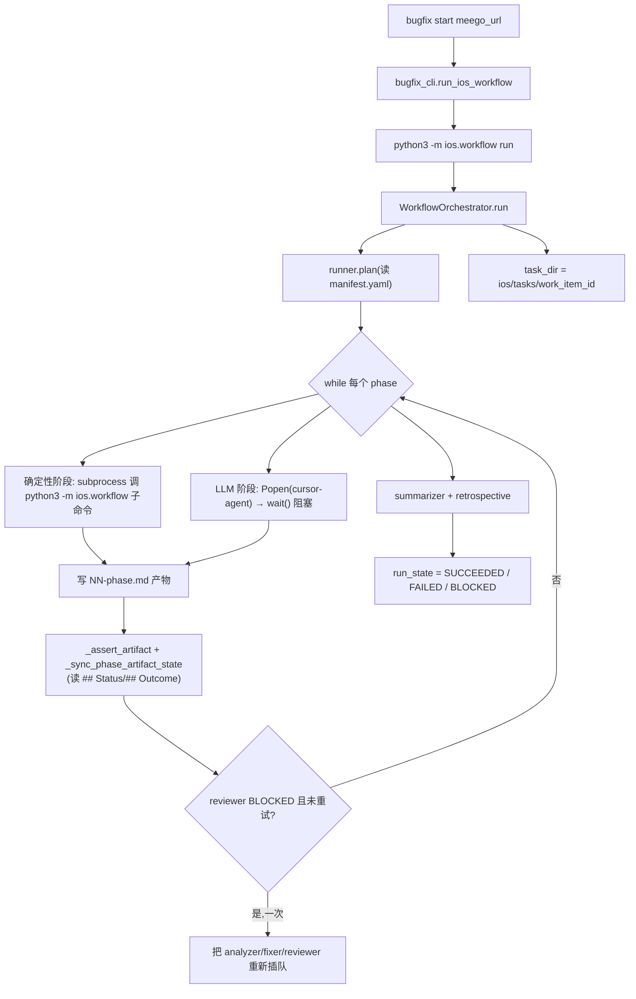

# Tako Bugfix 引擎 —— 介绍与架构参考

> 本文是对参考实现 **tako bugfix**（`tiktok-social-im-bugfix-agent`）的源码级总结，供 bugPilot 设计参考。
> 源码位置：`tiktok-ios-plugins-marketplace/plugins/tiktok-social-im-bugfix-agent/`

---

## 一、这是什么

一套**自动修 iOS bug 的流水线**：给它一个 Meego 工单 URL，它就自动从「拉取工单信息 → 根因分析 → 生成修复 → 静态审查 → 编译 → 真机/模拟器验证 → 提交 MR → 总结 → 复盘」端到端跑完，中途产物和状态全部落盘在 `ios/tasks/<工单ID>/`。

一句话定位：

> **一个确定性的 Python 编排引擎（orchestrator），把每个阶段的「智能活」外包给一个无头的 AI Agent 子进程（`cursor-agent` / `claude`）去干。**

---

## 二、核心架构理念（最关键，先记住）

### 是「引擎驱动 Agent」，不是「Agent 驱动引擎」

- **引擎（orchestrator）是大脑**：一段普通的 Python `while` 循环，负责决定「下一步派哪个阶段、跳过谁、重试谁」。它本身**不调用任何大模型**。
- **Agent 是工具**：轮到需要智能的阶段，引擎才起一个 `cursor-agent` 子进程，把活儿全包给它。Agent 在这一个阶段内部自主跑很多轮（读文件、改代码、跑命令），干完写一个产物文件后退出。
- **阶段之间只通过产物文件（`.md`）接力**，Agent 彼此之间从不直接对话，也不共享记忆。

### 分层调用关系

```
Python orchestrator（大脑，确定性 while 循环）
   └── 对每个 LLM 阶段：subprocess.Popen 起一次 cursor-agent / claude 子进程
          └── Agent 在这一个阶段内自主跑 N 轮（--max-turns 50），最后写出 NN-xxx.md
   └── 对每个确定性阶段：subprocess 调 python3 -m ios.workflow <子命令>
```

---

## 三、目录结构（关键部分）

```
tiktok-social-im-bugfix-agent/
├── scripts/bugfix            # 顶层 CLI launcher
├── tools/bugfix_cli.py       # 统一 CLI（init/doctor/start/summary/ui）
├── tools/parse_meego_ticket.py, download_ticket_images.sh, stream_parser.py ...
│
├── ios/
│   ├── workflow/             # ★ Python 编排引擎主体
│   │   ├── manifest.yaml         # 工作流真源：阶段定义、依赖、输入输出
│   │   ├── manifest_loader.py    # 解析 manifest.yaml → 类型对象
│   │   ├── models.py             # 数据契约（RunState / PhaseSpec / PhaseStatus...）
│   │   ├── orchestrator.py       # ★ 主编排器（端到端 while 循环）
│   │   ├── runner.py             # 阶段规划（plan）、resume-skip
│   │   ├── cli.py / __main__.py  # python3 -m ios.workflow 入口
│   │   ├── state_store.py        # run_state.json 持久化
│   │   ├── agent_backend.py      # ★ 调 cursor/claude CLI、拼 prompt、写日志
│   │   ├── runtime_prompt.py     # 合成完整 prompt（角色+任务+运行时上下文）
│   │   ├── prompt_builder.py / context_loader.py  # tester 模块化 prompt 组装
│   │   ├── info_collector.py     # 确定性 intake（Phase 1，2300+ 行正则提取）
│   │   ├── env_preparer.py       # 环境检查（Phase 0）
│   │   ├── executors/            # PhaseExecutor 抽象（目前主要给 tester）
│   │   └── prompts/tester/*.md   # tester 阶段的模块化 prompt 片段
│   │
│   ├── agents/*.md           # ★ 各阶段 Agent 角色提示词（code-analyzer.md, fixer.md ...）
│   ├── skills/**/SKILL.md    # iOS 专用可复用 skill
│   ├── review_ui/            # 运行中 Review UI（默认随 start 打开）
│   └── tasks/<work_item_id>/ # ★ 运行时产物目录（每个工单一个）
```

---

## 四、工作流阶段（11 个 phase）

阶段定义在 `ios/workflow/manifest.yaml`，由 orchestrator 按序驱动。

| # | Phase ID | 标签 | 默认跑 | 类型 | 产物文件 | 做什么 |
|---|----------|------|:----:|------|----------|--------|
| 0 | `env-preparer` | Environment | 否 | 确定性 | `00-env-preparer.md` | 依赖/工具链就绪检查 |
| 1 | `info-collector` | Intake | 是 | 确定性 | `01-info-collector.md` | 拉 Meego 工单、下附件、抽帧、结构化情报 |
| 2 | `code-analyzer` | Analysis | 是 | **LLM** | `02-code-analyzer.md` | 根因分析、影响面 |
| 2b | `debugger` | Debug & Reproduce | 否 | **LLM** | `02b-debugger.md` | 设备复现/调试证据 |
| 3 | `fixer` | Fix | 是 | **LLM** | `03-fixer.md` | 生成并提交代码修复 |
| 4a | `reviewer` | Static Review | 是 | **LLM** | `03a-reviewer.md` + `review_findings.json` | 静态 code review |
| 5 | `builder` | Build | 是 | **LLM** | `04-builder.md` | Xcode 编译、装模拟器 |
| 6 | `tester` | Verification | 是 | **LLM** | `05-tester.md` | 唯一 runtime 验证 agent（UI 复现+证据） |
| 7 | `submitter` | Submit | 是 | **LLM** | `06-submitter.md` | 提 MR / Bits 流程 |
| 8 | `summarizer` | Summary | 是 | **LLM** | `07-summarizer.md` | 汇总整个 run |
| 9 | `retrospective` | Retrospective | 是 | **LLM** | `08-retrospective.md` | 复盘、改进信号 |

**happy path**：`Intake → 根因分析 → 修复 → 静态Review → 编译 → 验证 → 提交 → 总结 → 复盘`

### 两类阶段的本质区别

1. **确定性阶段**（`env-preparer` / `info-collector`）：不经过 LLM。orchestrator 直接 `subprocess` 调 `python3 -m ios.workflow <子命令>`，用正则/API/子进程把活干完。**能用代码算的就别喂给大模型**（省钱、稳、可测）。
2. **LLM Agent 阶段**（其余 9 个）：orchestrator 拼 prompt → 起 `cursor-agent` 子进程 → 阻塞等待 → 解析产物。

---

## 五、控制流：orchestrator 主循环

入口链：

```
bugfix start <meego_url>
  → tools/bugfix_cli.py: run_ios_workflow()
    → python3 -m ios.workflow run --repo-root ... --backend cursor|claude <meego_url>
      → ios/workflow/cli.py: main()
        → WorkflowOrchestrator.run()   ← 主循环在这里
```

`WorkflowOrchestrator.run()` 的核心是一个 `while` 队列循环（`orchestrator.py`）：

```
phase_queue = 按 manifest 规划出的阶段列表
while 还有阶段:
    phase = 取下一个
    ① 策略跳过？（如工单是"存储空间不足"类 → 跳过 builder/tester）→ 写 skip 产物，continue
    ② resume-skip？（产物已存在且含必需章节，且非 --fresh）→ 标 SKIPPED，continue
    ③ 标记 RUNNING
    ④ rc = _run_phase(phase)          ← 真正执行（确定性子命令 或 起 Agent 子进程）
    ⑤ rc != 0 → 标 FAILED，整个 run 失败返回
    ⑥ _assert_artifact()             ← 校验产物必含 required_sections
    ⑦ _sync_phase_artifact_state()   ← 读产物的 ## Status / ## Outcome，定阶段状态
    ⑧ 需要重试？（reviewer BLOCKED 且没重试过）→ 把 code-analyzer/fixer/reviewer 重新插队
最后：据 workflow_outcome 收尾成 SUCCEEDED / FAILED / BLOCKED
```

`_run_phase` 通过 `_phase_handlers` 字典把 manifest 里的 `executor` 字段映射到对应的 `_phase_*` 方法。

---

## 六、Agent 是怎么被调用的（agent_backend.py）

**关键事实：调的不是模型 API，而是把 Cursor Agent 以命令行形态起了个子进程。** `cursor-agent` 本身就是完整的 Agent（同你在 IDE 窗口里用的那个），只是无头运行。

### 1. 构造命令

```
cursor-agent -p \
  --model <model> \
  --workspace <项目仓库路径> \   # ← 给它整个仓库当上下文，它自己读代码/读上一步产物
  --force --approve-mcps \
  --output-format stream-json --stream-partial-output \
  <full_prompt>                  # ← 拼好的完整 prompt 作为参数传入
```

（claude 后端类似：`claude -p --model ... --max-turns 50 --output-format stream-json ...`）

### 2. 起子进程 + 阻塞等待

```
backend_proc = subprocess.Popen(backend_cmd, ...)      # 起 Agent
parser_proc  = subprocess.Popen(stream_parser, stdin=backend_proc.stdout)  # 解析流式输出写日志
backend_rc = backend_proc.wait()   # ★ 引擎在这里阻塞死等，直到 Agent 退出
```

- **同步阻塞**：引擎 `wait()` 期间自己不做任何决策；Agent 独占运行。等待期间 Agent 的 stream-json 输出经 `stream_parser.py` 实时写进 `logs/NN-<phase>.log`（并可推给 Review UI）。
- **串行接力**：任一时刻要么引擎在跑（很快的确定性决策），要么 Agent 在跑（很慢的智能分析），**永不并行**。
- `--max-turns 50`：Agent 在单个阶段内最多自主 50 轮，防止无限跑。
- **cursor 自动降级**：非 `auto` 模型失败时，自动用 `model=auto` 重试一次。

### 3. Prompt 三段拼装（runtime_prompt.py）

一次 Agent 调用的 `full_prompt` = 三部分：

1. **角色 prompt**：`ios/agents/<phase>.md`（如 `code-analyzer.md`，定义"你是根因分析专家、要产出哪些章节"）。
2. **任务 prompt**：orchestrator 现拼的一行，告诉它读哪个文件、写到哪个文件。例如 code-analyzer：
   `work_item_id=... input_file=ios/tasks/<id>/01-info-collector.md output_file=ios/tasks/<id>/02-code-analyzer.md`
3. **运行时上下文**：工程路径、分支、worktree 等。

> `tester` 是特例：用 `assemble-runtime-prompt` + `prompt_builder.py` + `context_loader.py` 按条件（是否有 runtime gates、双开设备等）动态拼装模块化片段。

---

## 七、阶段间通信：产物文件是唯一的「共享记忆」

因为每个 LLM 阶段都是**重新起一个全新的 Agent 进程**，它们天然「失忆」、互不相通。接力全靠磁盘上的 `.md` 产物：

```
info-collector ─写→ 01-info-collector.md ─读→ code-analyzer ─写→ 02-code-analyzer.md ─读→ fixer ─写→ 03-fixer.md ...
```

orchestrator 在拼下一阶段 task prompt 时，会把上游已存在的产物路径作为 `input_files` 传进去，Agent 启动后自己去读。

---

## 八、Gate / Skip / Retry（引擎的确定性决策）

Agent 写完产物后，**引擎用纯文本解析**读产物里的固定标题来决策，**不再问大模型**：

### Gate（合规校验）
- `_assert_artifact()`：产物必须包含 manifest 声明的 `required_sections`（字符串匹配，所以标题固定、不翻译）。
- `_sync_phase_artifact_state()`：读 `## Status` / `## Outcome` 等标题决定阶段状态。例如：
  - `code-analyzer` 的 `## Outcome` = `need_more_info` / `non_client_issue` → BLOCKED，跳过后续。
  - `fixer` 的 `## Status` = `no_change_needed`（已修复）/ `blocked`（受阻）。
  - `builder` 的 `## Status` = `build_fail` → FAILED，跳过 tester。
  - `tester` 的 `## Status` = `pass`/`fail`/`blocked`，并读 `Pass Eligibility` 定验证置信度。

### Skip（跳过）
- **策略跳过**：intake 里出现"存储空间不足"等关键词 → 跳过 builder/tester（本地编译无意义）。
- **级联跳过**：上游失败会级联，如 reviewer 发现问题 → builder skip；builder 失败 → tester skip。
- **resume-skip**：产物已存在且合规、非 `--fresh` → 直接跳过（支持断点续跑）。

### Retry（重试）
- reviewer 结果为 `issues_found`（BLOCKED）且 `review_retry_count < 1` → 把 `code-analyzer → fixer → reviewer` 重新插入队列，最多重跑一轮。

---

## 九、状态持久化与产物目录

每个工单一个目录 `ios/tasks/<work_item_id>/`：

```
ios/tasks/<work_item_id>/
├── run_state.json          # 当前阶段、各阶段结果、human gate、验证状态（StateStore 维护）
├── metrics.json            # 各阶段耗时/token 快照
├── 00-env-preparer.md … 08-retrospective.md   # 各阶段产物（Agent 之间接力用）
├── review_findings.json    # 结构化 review 结果
├── review_comments.json    # Review UI 上人工评论（会注入下一次 prompt 做纠偏）
├── tester_operation_memory.md
└── logs/NN-<phase>.log     # 每阶段 Agent 的流式日志
```

- `run_state.json` 是「单一事实来源」：每推进一阶段就 load → 改 → save，进程中断也能续跑。
- `RunStatus`：idle / running / waiting_human / blocked / failed / succeeded / stopped。
- `PhaseStatus`：pending / running / succeeded / failed / blocked / skipped / needs_human。

---

## 十、数据流总览



---

## 十一、值得借鉴的设计点

1. **确定性编排 + LLM 当黑盒 worker**：顺序、跳过、重试、状态这些「必须可控」的逻辑全留在 Python 侧；「智能」全交给 Agent。可测、可复现、好调试。
2. **manifest 驱动**：改流程只动 `manifest.yaml`，不碰编排器代码。
3. **executor 注册表 + 接口**：加阶段 = 加一个 handler + manifest 几行，编排器不用改（开闭原则）。
4. **阶段间用产物文件松耦合**：每阶段产出一个带编号的 markdown，既是下游输入、又是给人看的日志、还天然支持续跑。
5. **确定性提取前置**（info-collector）：把原始工单加工成结构化情报再喂给 LLM，让后续 LLM 表现更稳。代价是这个文件 2300+ 行、正则堆砌、难维护——**这是"确定性走到极致"的取舍**。
6. **产物用固定英文标题**：因为 gate 靠字符串匹配 `## Status` 等，标题不能翻译。
7. **人工纠偏回路**：Review UI 的评论存 `review_comments.json`，会注入下一次 prompt 作为纠偏线索（而非直接改事实）。

**局限**：同步阻塞、纯串行（一次只跑一件事，慢）；`wait()` 无超时（Agent 卡死会一直等）；info-collector 领域规则硬编码，迁移成本高。

---

*本文基于 tako bugfix 源码（`orchestrator.py` / `agent_backend.py` / `info_collector.py` / `models.py` / `manifest.yaml`）整理。*
